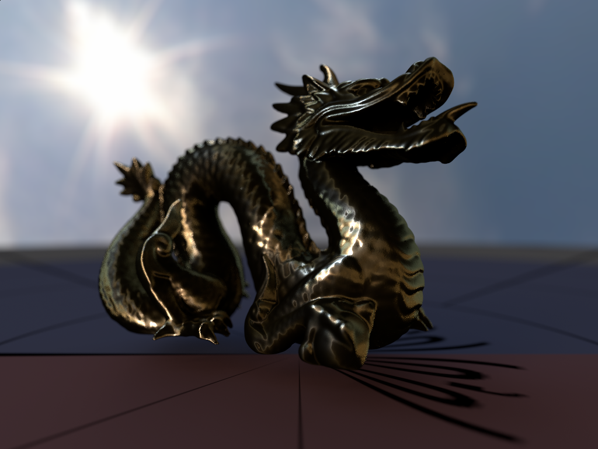

# Rustracer

Rustracer is a toy [raytracer](https://en.wikipedia.org/wiki/Ray_tracing_(graphics)) written in [Rust](http://rust-lang.org).

## History

It started as a little playground to play with raytracing concepts that I found on [Scratchapixel](http://www.scratchapixel.com). I then found out about [tray_rust](http://github.com/TwinkleBear/tray_rust) and began refactoring my code to follow its design, but then eventually bought a copy of [Physically-Based Ray Tracing](http://www.pbrt.org) and decided to follow the [C++ implementation](https://github.com/mmp/pbrt-v3) as closely as possible to make it easier to follow along with the book. Consider this a port of PBRTv3 to Rust.

**Note**: I am very much a beginner in Rust as well as in raytracing and this project is a way for me to learn about both. If the code is ugly or broken, it is very much my fault :) This is not helped by the fact that the C++ implementation is _very_ object-oriented, and doesn't always translate cleanly or idiomatically to Rust... I haven't really paid attention to performance yet, or number of allocations, so both are probably pretty bad :) That being said, feedback is more than welcome! 

## Related projects
 * [tray_rust](http://github.com/TwinkleBear/tray_rust): if you want to see a good physically-based raytracer in Rust written by someone who knows what they're talking about, you should check this project instead of mine :) It's got some nice features, like distributed rendering, and the code is beautifully written and documented.

 * [rs_pbrt](https://github.com/wahn/rs_pbrt): another port of PBRT to Rust.

## Examples

The dragon model is from [The Stanford Scanning Repository](http://graphics.stanford.edu/data/3Dscanrep/).

## Currently supported
 * Whitted and Direct Lighting integrators
 * Basic shapes (disc, sphere) + triangle meshes
 * Perspective camera with thin-lens depth-of-field
 * Point lights, distant lights
 * diffuse area lights
 * infinite light
 * BxDF for lambertian, perfect specular reflection / transmission, microfacet (Oren-Nayar and Torrance-Sparrow models, Beckmann and Trowbridge-Heitz distributions, Smith masking-shadowing function)
 * Matte, Plastic, Metal materials
 * Textures (imagemaps with MIPMapping, UV, CheckerBoard)
 * BVH (only with MIDDLE splitting strategy)
 * multi-threaded rendering
 * Support for PBRT scene file format (still incomplete)
 * Read textures in TGA or EXR (thanks to [openexr-rs](https://github.com/cessen/openexr-rs)

## TODO
 * More camera types (orthographic, realistic, environment)
 * More shapes (cone, paraboloid, hyperboloid, NURBs...)
 * More samplers (Haldon...)
 * More BxDFs and materials
 * Implement subsurface scattering
 * Bump mapping
 * Volumetric rendering
 * More integrators: path-tracing and bidirectional path tracing
 * Animations
 * Support for writing EXR files
 * Support for PLY meshes
 * more light types
 * Finish ray-differential support
 * Add support for EWA filtering for MIPMap
 * SAH strategy for BVH
 * k-d trees?
 * Spectral rendering?
 * ...

## License

Licensed under either of

 * Apache License, Version 2.0, ([LICENSE-APACHE](LICENSE-APACHE) or http://www.apache.org/licenses/LICENSE-2.0)
 * MIT license ([LICENSE-MIT](LICENSE-MIT) or http://opensource.org/licenses/MIT)

at your option.

